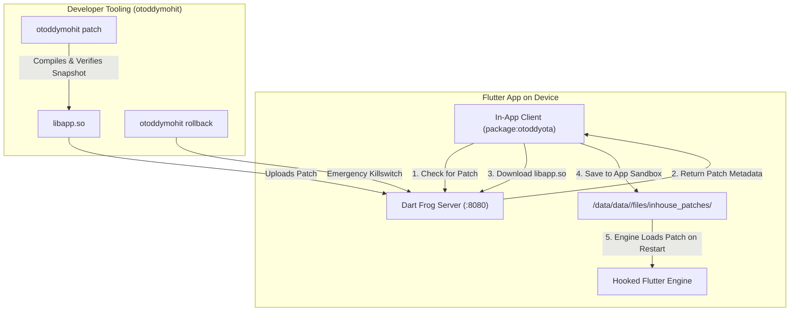

# OtoddyOTA - In-House Flutter CodePush Platform

[](https://pub.dev/packages/otoddyota)
[](https://opensource.org/licenses/MIT)

A self-hosted, enterprise-grade **Over-The-Air (OTA) Code Push platform for Flutter**, developed by **[OTODDY](https://otoddy.com)**.

Deliver instant Dart bug fixes, feature toggles, and UI updates directly to installed apps on user devices without waiting for Play Store reviews or reinstalling APKs.

---

## 🏢 About OTODDY

**[OTODDY](https://otoddy.com)** is a product-focused technology company building software products, digital platforms, and developer technologies that solve real-world problems. We create scalable, reliable, and user-centric technology across mobility, healthcare, business software, and emerging digital domains.

* **Website**: [https://otoddy.com](https://otoddy.com)
* **GitHub Repository**: [https://github.com/MohitMakhijani/otoddy_ota_inhouse](https://github.com/MohitMakhijani/otoddy_ota_inhouse)
* **Dart Pub Package**: [https://pub.dev/packages/otoddyota](https://pub.dev/packages/otoddyota)

---

## 🏗️ Architecture Overview



---

## 📦 Repository Layout

| Path | Purpose |
| :--- | :--- |
| **`packages/otoddyota/`** | The official Flutter client plugin published on [pub.dev](https://pub.dev/packages/otoddyota). |
| **`local-engine-maven/`** | Local Maven repository override hosting the patched Flutter embedding engine (`FlutterLoader`). |
| **`tooling/`** | Unified CLI tools (`otoddymohit.cmd`, `otoddymohit.ps1`, `push-patch.ps1`) for building releases and shipping patches. |
| **`server/`** | Production-ready Dart Frog backend providing patch management, telemetry, and emergency rollback. |
| **`example/`** & **`client_app/`** | Complete runnable Flutter applications demonstrating end-to-end OTA updates. |

---

## 🚀 Quickstart: otoddymohit CLI

From any Flutter project directory:

### 1. Build and Install Baseline Store Release
```powershell
otoddymohit release -Install
```
*Builds the release APK with the hooked Flutter engine and installs it onto your device or emulator.*

### 2. Ship an Over-The-Air Patch
Make any changes to your Dart code, then run:
```powershell
otoddymohit patch -Test
```
*Compiles the new AOT snapshot, verifies the engine snapshot hash, uploads Patch to your server, and tests delivery live on device.*

### 3. Check Live Telemetry & Connected Devices
```powershell
otoddymohit status
```

### 4. Emergency Killswitch (Rollback)
```powershell
otoddymohit rollback
```
*Instantly revokes the active patch across all user devices.*

---

## 📄 License

Distributed under the MIT License. See [LICENSE](LICENSE) for more information.

Built with ❤️ by **[OTODDY](https://otoddy.com)**.
